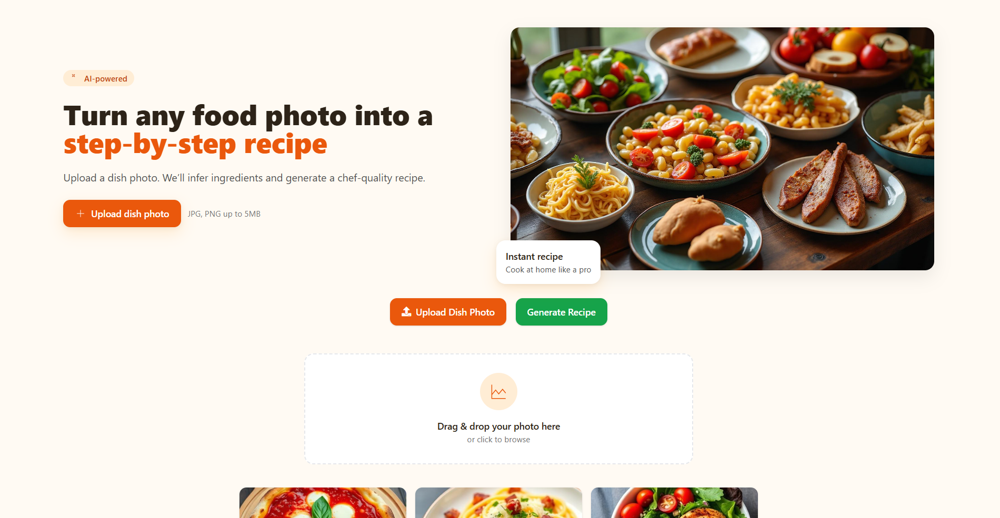
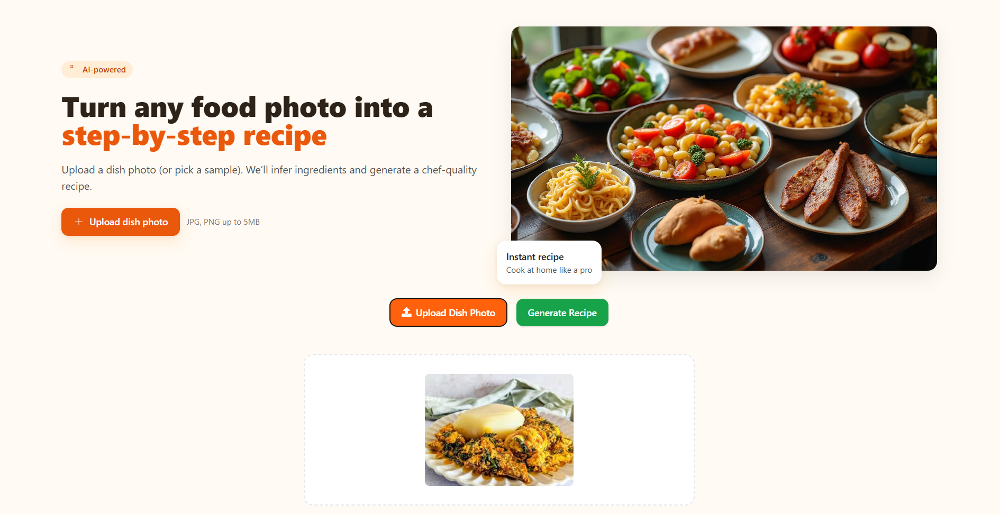
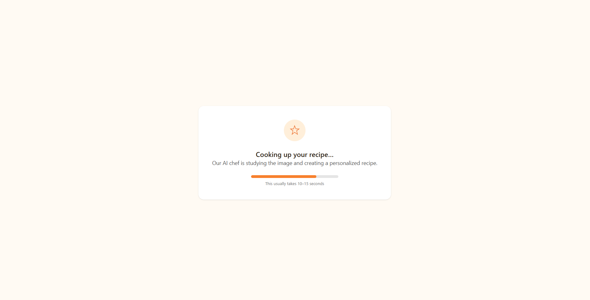
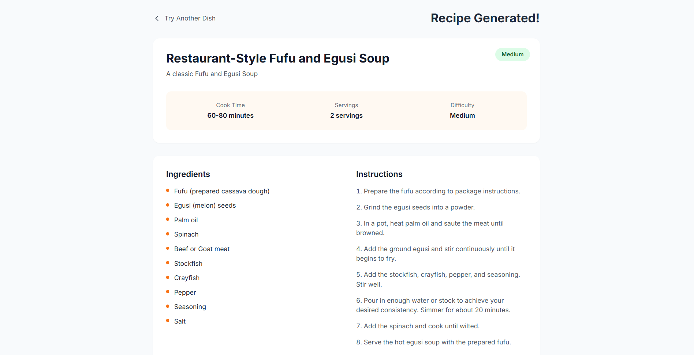
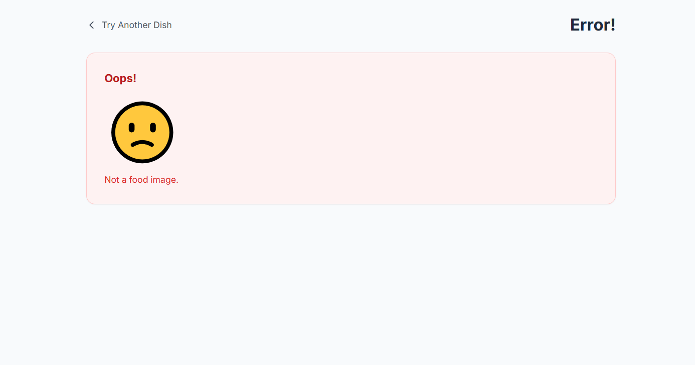

🧠 Project Overview
FoodSnap is an AI-powered web application that generates complete cooking recipes from food images. By leveraging the Google Gemini API, the system analyzes uploaded images, identifies food components, and produces structured recipes including ingredients and step-by-step instructions.

This project demonstrates the integration of computer vision and generative AI into a practical, real-world application.

🚀 Key Features
- Upload food images for analysis
- AI-powered ingredient recognition
- Automatic recipe generation
- Step-by-step cooking instructions
- Estimated cooking time and difficulty (if included)
- Dynamic response generation using Gemini API
- Responsive and user-friendly interface

🛠 Tech Stack
- Backend: Django
- Frontend: HTML, CSS, JavaScript
- AI Integration: Google Gemini API
- Image Processing: Gemini Vision capabilities

🤖 How It Works
- User uploads a food image
- The image is sent to the Gemini API
- The AI analyzes the image and identifies ingredients
- A structured recipe is generated including:
  - Recipe name
  - Ingredients list
  - Step-by-step instructions

AI systems like this combine image understanding and natural language generation to transform visual input into actionable recipes .

👨‍💻 My Contribution
I designed and developed the entire application, including:
- Integrating the Gemini API for image-to-text and recipe generation
- Handling image uploads and processing workflows
- Structuring AI responses into clean, readable recipes
- Designing backend logic for dynamic content generation
- Building the frontend interface for seamless user interaction

📸 Screenshots

📌 Future Improvements
- Ingredient substitution suggestions
- Multi-image support
- Voice-based input
- Mobile app version

⚙️ Installation & Setup
# Clone the repository
git clone https://github.com/Pharraoh/foodsnap.git

# Navigate into the project
cd foodsnap

# Create virtual environment
python -m venv venv

# Activate environment
venv\Scripts\activate
# or
source venv/bin/activate

# Install dependencies
pip install -r requirements.txt

Create a .env file:
- GEMINI_API_KEY=your_api_key_here (Generate a Gemini API key prior)

▶️ Run the App
- python manage.py migrate
- python manage.py runserver
